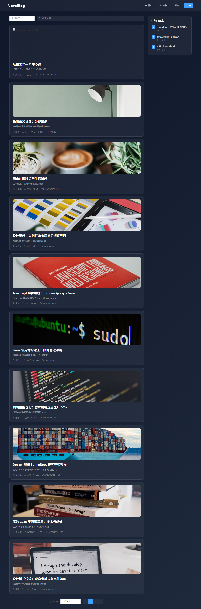
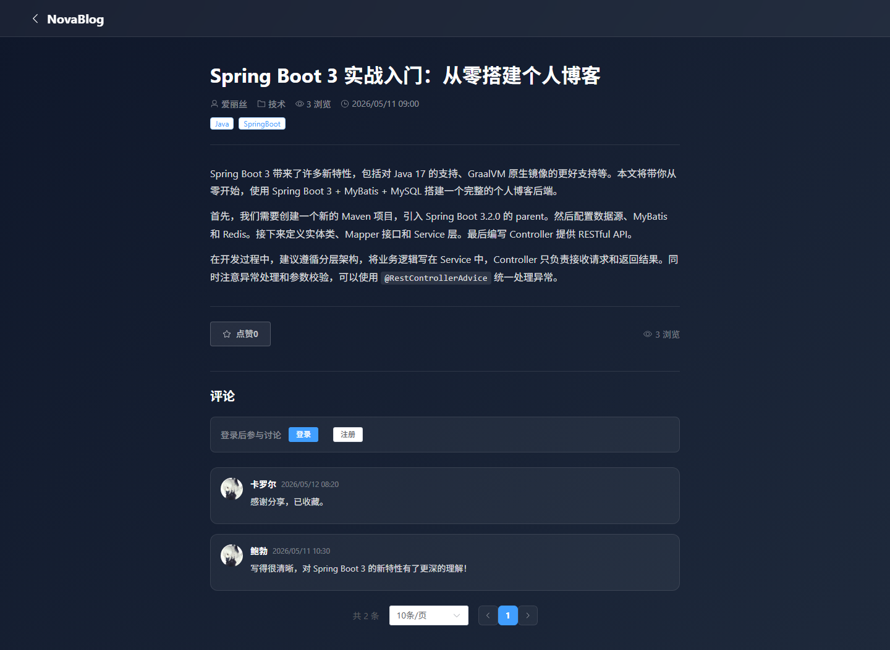
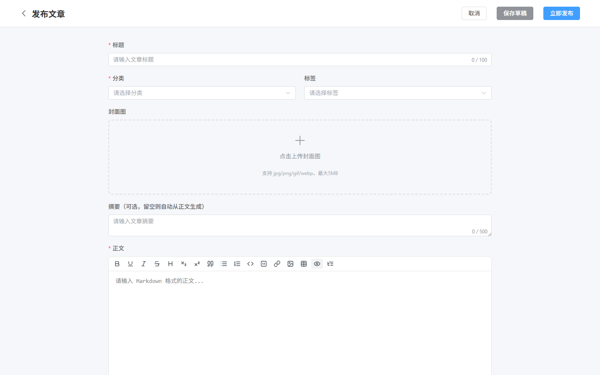
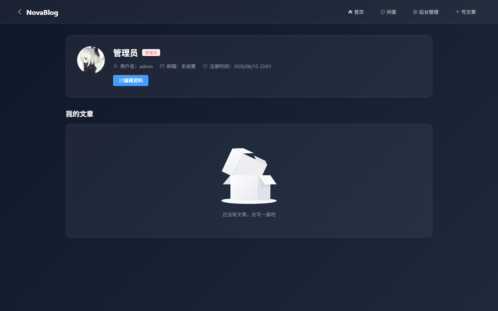
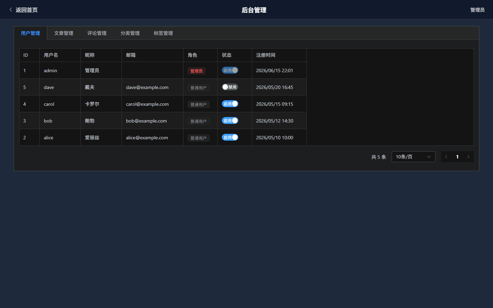

# NovaBlog

NovaBlog 是一个全栈个人博客系统，采用前后端分离架构，开发遵循**后端先行、立即联调**的工作流。

## 技术栈

### 后端

| 技术 | 版本 | 用途 |
|------|------|------|
| Java | 17 | 编程语言 |
| SpringBoot | 3 | Web 框架 |
| MyBatis | — | ORM 框架 |
| MySQL | 8 | 关系型数据库 |
| Redis | — | 缓存与计数 |
| JWT | — | 身份认证 |
| Maven | — | 构建工具 |

### 前端

| 技术 | 版本 | 用途 |
|------|------|------|
| Vue | 3 | 前端框架 |
| Vite | — | 构建工具 |
| Element Plus | — | UI 组件库 |
| Axios | — | HTTP 客户端 |
| Pinia | — | 状态管理 |

## 项目结构

```
NovaBlog/
├── novablog-server/        # SpringBoot 后端
│   ├── pom.xml
│   ├── sql/                # 数据库初始化脚本
│   └── src/main/java/com/novablog/
│       ├── NovaBlogApplication.java
│       ├── config/         # Security, Redis, Web, Cors 配置
│       ├── controller/     # REST 控制器
│       ├── service/        # 业务逻辑 + impl/
│       ├── mapper/         # MyBatis Mapper
│       ├── entity/         # 数据库实体
│       ├── dto/            # 请求/响应 DTO
│       ├── vo/             # 视图对象
│       ├── common/         # Result, PageResult, 异常, 注解
│       ├── interceptor/    # JWT 认证拦截器
│       ├── task/           # 定时任务（Redis 同步）
│       └── util/           # JwtUtil, RedisUtil, PasswordUtil
│   └── src/main/resources/
│       ├── application.yml         # 公共配置
│       ├── application-dev.yml     # 本地开发配置（gitignore）
│       └── mapper/*.xml            # MyBatis XML 映射
├── novablog-web/           # Vue3 前端
│   ├── src/
│   │   ├── api/            # Axios API 模块
│   │   ├── views/          # 页面组件
│   │   ├── router/         # Vue Router 配置
│   │   ├── stores/         # Pinia 状态管理
│   │   └── utils/          # 请求拦截器、工具函数
│   └── dist/               # 构建输出
└── README.md
```

## 快速开始

### 环境要求

- JDK 17+
- Node.js 18+
- MySQL 8
- Redis

### 1. 克隆项目

```bash
git clone <repository-url>
cd NovaBlog
```

### 2. 初始化数据库

```bash
cd novablog-server
mysql -u root -p < sql/init.sql
```

如果需要体验带有模拟数据的完整效果，可继续导入种子数据：

```bash
mysql -u root -p novablog < sql/seed_data.sql
```

### 3. 启动后端

```bash
cd novablog-server
# 复制开发配置模板
cp src/main/resources/application-dev.yml.example src/main/resources/application-dev.yml
# 修改 application-dev.yml 中的数据库和 Redis 密码
mvn spring-boot:run
```

后端服务默认运行在 `http://localhost:8080`。

### 4. 启动前端

```bash
cd novablog-web
npm install
npm run dev
```

前端开发服务器默认运行在 `http://localhost:3000`。

## 核心功能

- **用户模块**：注册、登录、JWT 认证
- **文章模块**：发布、列表、详情、编辑、删除
- **评论模块**：发表评论、嵌套评论、回复
- **Redis 功能**：浏览量统计、点赞、热门文章排行
- **个人中心**：信息修改、头像上传、我的文章
- **后台管理**：用户/文章/评论/分类/标签管理
- **文件上传**：头像、文章封面

## 项目展示

### 首页

暗色主题下的文章列表，支持分类筛选、关键词搜索和热门文章侧边栏。



### 文章详情

Markdown 渲染正文、点赞按钮与嵌套评论系统。



### 文章编辑器

基于 md-editor-v3 的 Markdown 编辑器，支持封面上传、分类与标签选择。



### 个人中心

展示与编辑用户资料、头像上传以及"我的文章"管理列表。



### 后台管理

管理员可对用户、文章、评论、分类和标签进行统一管理。



## API 概览

后端采用 RESTful 风格，**不使用 `/api` 前缀**。前端通过 Vite 代理在请求时添加 `/api` 前缀，代理转发到后端时自动去除。

| 资源 | 创建 | 查询 | 更新 | 删除 |
|------|------|------|------|------|
| 用户 | `POST /user/register` | `GET /user/profile` | `PUT /user/profile` | — |
| 文章 | `POST /article` | `GET /article/list`, `GET /article/{id}` | `PUT /article` | `DELETE /article/{id}` |
| 评论 | `POST /comment` | `GET /comment/list` | — | — |
| 文件 | `POST /upload` | — | — | — |

## 数据库设计

### 表结构

| 表名 | 说明 |
|------|------|
| `user` | 用户：id, username, password, nickname, avatar, email, role, status |
| `article` | 文章：id, title, content, summary, cover, view_count, like_count, user_id, category_id, status |
| `category` | 分类：id, name, description |
| `tag` | 标签：id, name |
| `article_tag` | 文章-标签关联：article_id, tag_id |
| `comment` | 评论：id, content, article_id, user_id, parent_id, reply_to_id, status |

### Redis + MySQL 双写策略

- 用户操作时先写 Redis（保证响应速度）
- 优先从 Redis 读取，Redis 异常时降级读 MySQL
- 定时任务每小时将 Redis 数据同步回 MySQL
- 应用启动时，若 Redis 为空，从 MySQL 加载初始值

## 安全规范

- **密码存储**：使用 BCrypt 哈希，强度因子 10-12
- **JWT**：Access Token 2 小时，Refresh Token 7 天，密钥至少 256 位
- **文件上传**：限制图片格式（jpg/png/gif/webp），单文件不超过 5MB，使用随机文件名