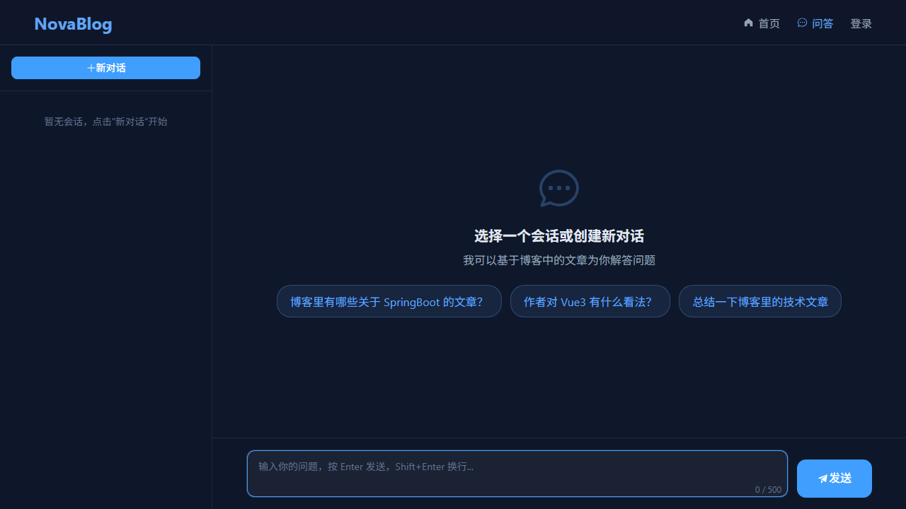

# NovaBlog

NovaBlog 是一个基于 SpringBoot + Vue3 的全栈个人博客系统，同时被打造成一个**后端面试复习知识库**。除了完整的博客功能外，还集成了 **AI 对话**与 **RAG 检索增强**能力，可以基于博客内容智能答疑。

项目开发遵循**后端先行、立即联调**的工作流，设计文档存放于 `design/` 目录。

## 技术栈

### 后端

| 技术 | 版本 | 用途 |
|------|------|------|
| Java | 17 | 编程语言 |
| SpringBoot | 3 | Web 框架 |
| Spring AI | 1.0.0 | AI 对话与 Embedding 抽象 |
| Spring AI Alibaba | 1.0.0.4 | 阿里云百炼/通义模型支持 |
| MyBatis | — | ORM 框架 |
| MySQL | 8 | 关系型数据库 + JSON 向量存储 |
| Redis | — | 缓存、计数、排行榜 |
| JWT | — | 身份认证 |
| Maven | — | 构建工具 |

### 前端

| 技术 | 版本 | 用途 |
|------|------|------|
| Vue | 3 | 前端框架 |
| Vite | — | 构建工具 |
| Element Plus | — | UI 组件库 |
| Axios | — | HTTP 客户端 |
| Pinia | — | 状态管理 |
| marked | — | Markdown 渲染 |
| DOMPurify | — | XSS 防护 |

## 项目结构

```
NovaBlog/
├── design/                 # 功能设计文档
├── docs/                   # 项目文档与截图
├── novablog-server/        # SpringBoot 后端
│   ├── pom.xml
│   ├── sql/                # 数据库初始化与种子脚本
│   └── src/main/java/com/novablog/
│       ├── NovaBlogApplication.java
│       ├── aop/            # 自动填充时间等切面
│       ├── chat/           # AI 对话模块
│       ├── common/         # Result, PageResult, 异常, 注解, 枚举
│       ├── config/         # AI、Security、Redis、Web、Cors 配置
│       ├── controller/     # REST 控制器
│       ├── dto/            # 请求/响应 DTO
│       ├── entity/         # 数据库实体
│       ├── interceptor/    # JWT 认证拦截器、RAG 限流拦截器
│       ├── mapper/         # MyBatis Mapper
│       ├── rag/            # RAG 检索增强模块
│       ├── service/        # 业务逻辑 + impl/
│       ├── task/           # 定时任务（Redis 同步、索引同步）
│       ├── util/           # JwtUtil, RedisUtil, PasswordUtil
│       └── vo/             # 视图对象
│   └── src/main/resources/
│       ├── application.yml         # 公共配置
│       ├── application-dev.yml     # 本地开发配置（gitignore）
│       └── mapper/*.xml            # MyBatis XML 映射
├── novablog-web/           # Vue3 前端
│   ├── src/
│   │   ├── api/            # Axios API 模块
│   │   ├── components/     # 公共组件（侧边栏、布局等）
│   │   ├── composables/    # 组合式函数
│   │   ├── router/         # Vue Router 配置
│   │   ├── stores/         # Pinia 状态管理
│   │   ├── utils/          # 请求拦截器、工具函数
│   │   └── views/          # 页面组件
│   └── dist/               # 构建输出
└── README.md
```

## 快速开始

### 环境要求

- JDK 17+
- Node.js 18+
- MySQL 8
- Redis
- （可选）DeepSeek / OpenAI / 阿里云百炼 API Key

### 1. 克隆项目

```bash
git clone <repository-url>
cd NovaBlog
```

### 2. 初始化数据库

```bash
cd novablog-server
mysql -u root -p < sql/init.sql
```

如果需要体验带有面经模拟数据的完整效果，可继续导入种子数据：

```bash
mysql -u root -p novablog < sql/seed_data.sql
```

> `seed_data.sql` 内置了「面经」分类、后端面试标签和 15 篇高频后端面试文章，适合直接用于面试复习场景。

### 3. 配置后端

```bash
cd novablog-server
# 复制开发配置模板
cp src/main/resources/application-dev.yml.example src/main/resources/application-dev.yml
# 修改 application-dev.yml 中的数据库、Redis 和 AI 配置
```

AI 配置示例：

```yaml
ai:
  enabled: true
  chat:
    provider: deepseek
    deepseek:
      api-key: sk-xxx
      model: deepseek-chat
  embedding:
    provider: openai
    openai:
      api-key: sk-xxx
      model: text-embedding-3-small
  rag:
    top-k: 5
    rate-limit-per-minute: 10
```

### 4. 启动后端

```bash
mvn spring-boot:run
```

后端服务默认运行在 `http://localhost:8080`。

### 5. 启动前端

```bash
cd novablog-web
npm install
npm run dev
```

前端开发服务器默认运行在 `http://localhost:3000`。

## 核心功能

### 博客基础功能

- **用户模块**：注册、登录、JWT 认证
- **文章模块**：发布、列表、详情、编辑、删除、Markdown 渲染
- **评论模块**：发表评论、嵌套评论、回复
- **分类/标签**：支持筛选与检索，默认面经方向
- **Redis 功能**：浏览量统计、点赞、热门文章排行
- **个人中心**：信息修改、头像上传、我的文章、用户名/密码修改
- **后台管理**：用户/文章/评论/分类/标签管理，支持用户关键词查询与批量删除
- **文件上传**：头像、文章封面

### AI 功能

- **AI 对话**：登录用户可创建多轮会话，基于博客知识库回答问题
- **RAG 检索增强**：文章自动切分并向量化，问答时先检索相关片段再生成回答
- **流式输出**：SSE 流式打字效果，支持 Markdown 渲染
- **来源引用**：AI 回答会标注引用的博客文章
- **模型可切换**：支持 DeepSeek、OpenAI、阿里云百炼

## 项目展示

### 首页

暗色主题下的文章列表，支持分类筛选、关键词搜索和热门文章侧边栏。


### 文章详情

Markdown 渲染正文、点赞按钮与嵌套评论系统。


### 文章编辑器

基于 md-editor-v3 的 Markdown 编辑器，支持封面上传、分类与标签选择。


### 个人中心

展示与编辑用户资料、头像上传以及"我的文章"管理列表。


### AI 对话

基于博客知识库的多轮对话，支持流式输出与来源文章展示。



### 后台管理

管理员可对用户、文章、评论、分类和标签进行统一管理。


## API 概览

后端采用 RESTful 风格，**不使用 `/api` 前缀**。前端通过 Vite 代理在请求时添加 `/api` 前缀，代理转发到后端时自动去除。

### 基础资源

| 资源 | 创建 | 查询 | 更新 | 删除 |
|------|------|------|------|------|
| 用户 | `POST /user/register` | `GET /user/profile` | `PUT /user/profile` | — |
| 用户（管理）| — | `GET /user/admin/list?keyword=...` | `PUT /user/admin/status` | `DELETE /user/admin/batch` |
| 文章 | `POST /article` | `GET /article/list`, `GET /article/{id}` | `PUT /article` | `DELETE /article/{id}` |
| 评论 | `POST /comment` | `GET /comment/list` | — | — |
| 文件 | `POST /upload` | — | — | — |

### AI 接口

| 功能 | 接口 |
|------|------|
| 创建会话 | `POST /chat/session` |
| 会话列表 | `GET /chat/session/list` |
| 同步问答 | `POST /chat/ask` |
| 流式问答 | `GET /chat/ask/stream` |
| 编辑并重生成 | `PUT /chat/session/{id}/message/{msgId}` |
| RAG 问答 | `POST /rag/ask` / `GET /rag/ask/stream` |
| 重建索引 | `POST /rag/reindex` |
| 索引状态 | `GET /rag/status` |

## 数据库设计

### 表结构

| 表名 | 说明 |
|------|------|
| `user` | 用户 |
| `article` | 文章，含 `indexed` 索引状态字段 |
| `category` | 分类 |
| `tag` | 标签 |
| `article_tag` | 文章-标签关联 |
| `comment` | 评论 |
| `article_chunk` | 文章向量片段，用于 RAG 检索 |
| `chat_session` | AI 对话会话 |
| `chat_message` | AI 对话消息 |

### Redis + MySQL 双写策略

- 用户操作时先写 Redis（保证响应速度）
- 优先从 Redis 读取，Redis 异常时降级读 MySQL
- 定时任务每小时将 Redis 数据同步回 MySQL
- 应用启动时，若 Redis 为空，从 MySQL 加载初始值

### RAG 向量索引

- 文章发布/更新后自动异步切分并生成 Embedding
- 向量存储在 MySQL `article_chunk.embedding` JSON 字段中
- 检索时计算余弦相似度，返回最相关的 Top-K 片段
- 管理员可手动触发全量重建索引

## 安全规范

- **密码存储**：使用 BCrypt 哈希，强度因子 10-12
- **JWT**：Access Token 2 小时，Refresh Token 7 天，密钥至少 256 位
- **文件上传**：限制图片格式（jpg/png/gif/webp），单文件不超过 5MB，使用随机文件名
- **SQL 注入**：MyBatis 使用 `#{}` 预编译参数
- **XSS 防护**：前端 DOMPurify 过滤用户内容
- **限流**：RAG 问答接口对 IP 进行分钟级限流
